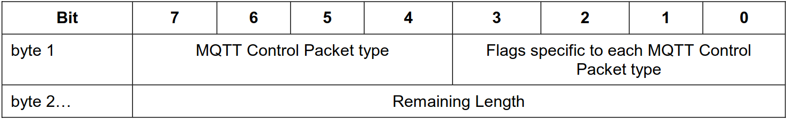

# About this file

This file makes some considerations about the implementation of the MQTT Protocol, especially about the Control Packets. It is also important to consult the [official documentation](http://docs.oasis-open.org/mqtt/mqtt/v3.1.1/os/mqtt-v3.1.1-os.pdf).

# 2. MQTT Control Packet format

## 2.1. Structure of an MQTT Control Packet

|                        Structure                        |
:---------------------------------------------------------:
|Fixed header, **present in all MQTT Control Packets**    |
|Variable header, **present in some MQTT Control Packets**|
|Payload header, **present in some MQTT Control Packets** |

## 2.2. Fixed header

### 2.2.1. MQTT Control Packet type
**Position:** byte 1, bits 7 - 4.

| Name | Value | Direction of flow |
| :--: | :---: | :---------------: |
| [CONNECT](#31-connect) | 1 | Client to Server |
| [PUBLISH](#33-publish) | 3 | Client to Server or Server to Client |
| [DISCONNECT](#314-disconnect) | 14 | Client to Server |

### 2.2.2. Flags
**Position:** byte 1, bits 3 - 0.

| Name | Fixed header flags |
| :--: | :----------------: |
| [CONNECT](#31-connect) | Reserved |
| [PUBLISH](#33-publish) | Used in MQTT 3.1.1 |
| [DISCONNECT](#314-disconnect) | Reserved |

### 2.2.3. Remaining Length
**Position:** starts at byte 2.

Number of bytes remaining within the current packet, including data in the variable header and the payload.

## 2.3. Variable header

The content of the variable header varies depending on the Packet type. The Pakect Identifier field of variable header is common in several packet types.

### 2.3.1. Packet Identifier

The variable header component of many of the Control Packet types includes a 2 byte Packet Identifier field.

| Control Packet | Packet Identifier field |
| :------------: | :---------------------: |
| CONNECT | NO |
| PUBLISH | YES (QoS > 0) |
| DISCONNECT | NO |

The Client and Server assign Packet Identifiers independently of each other.

## 2.4. Payload

Some MQTT Control Packets contain a payload as the final part of the packet.

| Control Packet | Payload |
| :------------: | :-----: |
| CONNECT | Required |
| PUBLISH | Optional |
| DISCONNECT | None |

# 3. MQTT Control Packets

## 3.1. CONNECT

The first packet sent from the Client to the Server **MUST** be a CONNECT packet. If a Client send a second CONNECT packet, the Server **MUST** process this packet as a protocol violations and disconnect the Client.

### 3.1.2. Variable header

- Protocol Name (byte 1 - 6)
- Protocol Level (byte 7)
- Connect Flags (byte 8)
- Keep Alive (byte 9 - 10)

#### 3.1.2.1. Protocol Name

If the protocol name is incorrect the Server **MUST** disconnect the Client.

#### 3.1.2.2. Protocol Level

If the protocol level(4) is not supported by the Server, then it **MUST** disconnect the Client.

#### 3.1.2.3. Connect Flags

If the reserved flag is not set to zero, then the Server **MUST** disconnect the Client.

**Check the meaning of the other bits**

### 3.1.3. Payload

The presence of the payload is determined by the flags in the [Variable header](#312-variable-header). These fields, if present, **MUST** appear in the following order:
1. Client Identifier (UTF-8)
2. Will Topic (UTF-8)
3. Will Message
4. User Name (UTF-8)
5. Password

### 3.1.3. Response

- If the server does not receive a CONNECT Packet within a reasonable amount of time after the connection, it **SHOULD** close the connection.
- If the ClientId represents a Client already connected, the Server **SHOULD** disconnect the existing Client.

## 3.3. PUBLISH

### 3.3.2. Variable header
The variable header contains the following fields in the order:
1. Topic Name (UTF-8)
2. Packet Identifier (Present if the QoS level is 1 or 2)

### 3.3.3. Payload
Contains the Application Message that is being published. It is valid for a PUBLISH Packet to contain a zero length payload.

### 3.3.4. Response
The receiver of a PUBLISH Packet **MUST** respond according to the QoS in the Packet.
| QoS | Expected Response |
| :-: | :---------------: |
| 0   | None              |
| 1   | PUBACK            |
| 2   | PUBREC            |

### 3.3.5. Actions
The Server uses a PUBLISH Packet to send an Application Message to each Client which has a matching subscription.

The Server **MUST** deliver the message to the Client respecting the maximum QoS of all the matching subscriptions.

## 3.14. DISCONNECT

This is the final Control Packet sent from the Client to the Server. It indicates that the Client is disconnecting cleanly.

### 3.14.1. Fixed header

The Server **MUST** validate that reserved bits are set to zero, if not, it will disconnect the Client.

### 3.14.2. Variable header

No variable header.

### 3.14.3. payload

No payload.

### 3.14.4 Response

Client:
- **MUST** close the Network Connection
- **MUST NOT** send any more Control Packets

Server:
- **MUST** discard any Will Message associated with the current connection without publishing it
- **SHOULD** close the Network Connections if the Client has not already done so